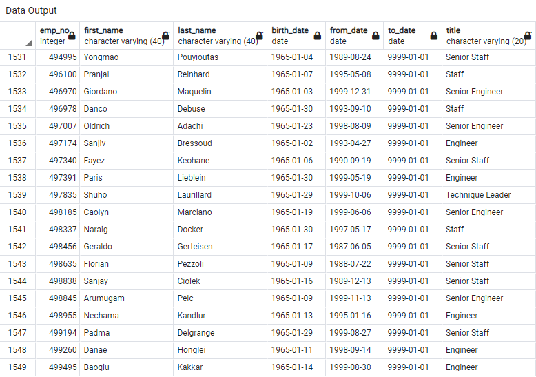
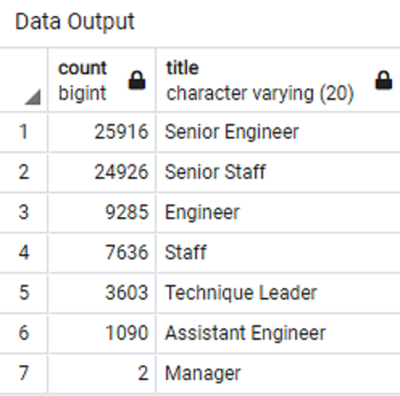

# Pewlett-Hackard-Analysis

## Overview

The purpose of this project is to use PostgreSQL to analyze data on a company's employees to determine how many will be retiring in the next few years. Furthermore, new tables are formed using joins to gain insight on the breakdown of retirees per department, as well as how many would be eligible for a proposed mentorship program. 

## Results

- PH has a grand total of 72,458 employees retiring in the next few years
- PH is going to have a monumental amount of senior staff retiring in the next few years, so it would be prudent to start thinking about how they will go about finding replacements with the required experience
- On the other hand, only two of PH's managers will be retiring in the next few years
- PH has 1,549 eligible employees that could serve as mentors for newer employees

 <br />


## Summary

### Size of the Silver Tsunami

PH is going to have a grand total of 72,458 employees retiring in the next few years. While this is not that unexpected when the size of the company is considered, it will still take a well thought out plan of action to find suitable replacements in a reasonable amount of time. Hopefully, the proposed mentorship program gains enough traction to help counteract the effects of this retirement wave. 

### Mentorship Program 

PH will have 1,549 potential mentors, which should be a suitable amount if they can all be persuaded to participate. Furthermore, each mentor would have to take on multiple mentees. This should not be an issue as it is unlikely that each new employee will need rigorous mentoring after their first few months with PH, allowing for more time to be dedicated to any newer employees hired. 

Of the 1,549 potential mentors, 462 have been with PH since between 1985 and 1989 (no current employees were hired further back than January 1, 1985). It is likely that of the retiring employees, these would be the most likely to be open to mentoring new employees. To stay with a single company for so many decades would likely require a sense of loyalty and affinity for the PH, making them prime candidates to usher in the employees of the future

```
select count(*) from mentorship_eligibility 
where (to_date = '9999-01-01') and (from_date between '1900-01-01' and '1989-12-31');
```

By altering the code that joins the employees, dept_emp, and titles tables into the mentorship_eligibility table to include the gender column from employees, it can be determined that 643 of the potential mentors (roughly 41.5%) are women. While they should not be restricted to only mentoring other women, some may have experiences from when they were new employees involving the unique obstacles women face in the financial industry. Some may be interested in creating a subsect of the mentorship program that would focus on mentoring and empowering women in an industry that has an unfortunate history of workplace discrimination. 

```
select distinct on (e.emp_no) e.emp_no, e.first_name, e.last_name, e.birth_date, e.gender, de.from_date, de.to_date, t.title
into mentorship_eligibility
from employees as e
join dept_emp as de on (e.emp_no = de.emp_no)
join titles as t on (e.emp_no = t.emp_no)
where (e.birth_date between '1965-01-01' and '1965-12-31') and (de.to_date = '9999-01-01')
order by e.emp_no
;

select count(*) from mentorship_eligibility
where gender = 'F'
```
